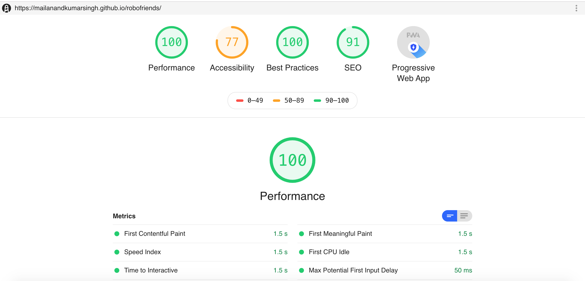

The Full Stack Course,

ReactJS library for rendering

Redux for State Management

REDUX THUNK for asynchronous call and updation of the State.

REDUX LOGGER - LOGGING MIDDLEWARE for ACTION TRANSITIONS

yarn eject - to modify few webpack files.

tachyons for styling

PWA 

